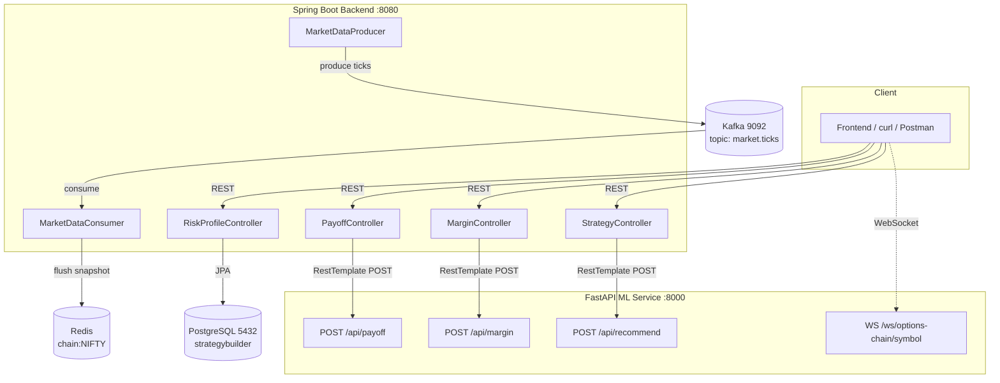
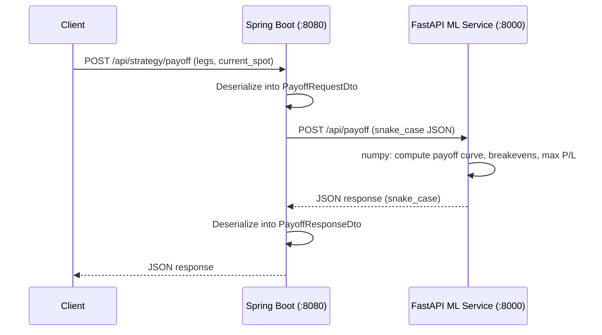
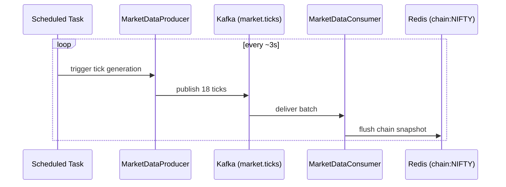

# Strategy Builder — Moneylogix

An options strategy builder platform that profiles a user's risk appetite, recommends option strategies, streams live options-chain data, and calculates payoff diagrams and margin requirements.

Repo: [Ananya-patel/Strategy_builder_moneylogix](https://github.com/Ananya-patel/Strategy_builder_moneylogix)

---

## Table of Contents

- [Architecture](#architecture)
- [Tech Stack](#tech-stack)
- [Project Structure](#project-structure)
- [Prerequisites](#prerequisites)
- [Setup & Run](#setup--run)
- [API Reference](#api-reference)
- [Data Flow Diagrams](#data-flow-diagrams)
- [Build Progress](#build-progress)
- [Troubleshooting](#troubleshooting)
- [Git Workflow](#git-workflow)

---

## Architecture



**Two services work together:**
1. **Spring Boot backend** — owns persistence (risk profiles in Postgres via Flyway-migrated schema), exposes REST APIs, and proxies compute-heavy requests (payoff, margin, recommendation) to the Python ML service via `RestTemplate`.
2. **FastAPI ML service** — stateless numeric engine (numpy-based) for payoff curves, margin estimation, strategy recommendation, and a simulated live options-chain WebSocket feed.

A separate real-time pipeline (Kafka → Redis) simulates live market ticks independently of the ML service, feeding a `chain:{SYMBOL}` snapshot into Redis every few seconds.

---

## Tech Stack

| Layer | Technology |
|---|---|
| Backend | Java 17+, Spring Boot 4.1.0, Spring Data JPA, Spring Data Redis, Spring Security (dev-mode, unauthenticated) |
| ML Service | Python, FastAPI, NumPy, Pydantic |
| Database | PostgreSQL 16 |
| Migrations | Flyway |
| Cache / Snapshot store | Redis |
| Streaming | Apache Kafka (topic: `market.ticks`) |
| Build tool | Maven |

---

## Project Structure
strategy-builder/
├── backend/                                # Spring Boot service
│   ├── src/main/java/com/moneylogix/strategybuilder/
│   │   ├── StrategyBuilderBackendApplication.java
│   │   ├── riskprofile/
│   │   │   ├── RiskProfile.java            # JPA entity
│   │   │   ├── RiskProfileController.java
│   │   │   ├── RiskProfileRepository.java
│   │   │   ├── RiskProfileRequestDto.java
│   │   │   ├── RiskProfileResponseDto.java
│   │   │   └── RiskProfileService.java
│   │   ├── strategy/
│   │   │   ├── OptionLegDto.java
│   │   │   ├── PayoffRequestDto.java
│   │   │   ├── PayoffResponseDto.java
│   │   │   ├── PayoffController.java
│   │   │   ├── MarginRequestDto.java
│   │   │   ├── MarginResponseDto.java
│   │   │   ├── MarginController.java
│   │   │   └── StrategyController.java     # /api/strategy/recommend
│   │   └── marketdata/
│   │       ├── MarketDataProducer.java     # publishes ticks to Kafka
│   │       └── MarketDataConsumer.java     # flushes chain snapshot to Redis
│   ├── src/main/resources/
│   │   ├── application.yml
│   │   └── db/migration/                   # Flyway SQL scripts (V1__..V6__)
│   └── pom.xml
│
└── ml-service/                             # FastAPI service
└── main.py                             # recommend, payoff, margin, options-chain WS
---

## Prerequisites

Install and have running locally:

- **Java 17+** and **Maven**
- **Python 3.10+** with `pip`
- **PostgreSQL 16** — database `strategybuilder` created
- **Redis** — running on default port 6379
- **Kafka** — running on `localhost:9092` with topic `market.ticks` (auto-created if `allow.auto.create.topics=true`)
- **Docker** (optional, if running Postgres/Redis/Kafka as containers)

---

## Setup & Run

### 1. Start infrastructure (Postgres, Redis, Kafka)

If using Docker for these, start them first and confirm they're reachable on their default ports. If disk space runs low, clean up unused Docker data:

```powershell
docker system prune -f
docker volume prune -f
```

### 2. Start the ML service (FastAPI)

```cmd
cd ml-service
pip install fastapi uvicorn numpy pydantic --break-system-packages
uvicorn main:app --reload --port 8000
```

Verify it's up:
```cmd
curl http://localhost:8000/health
```
Expected: `{"status":"ok"}`

> **Note:** run with `--reload` during development — without it, `main.py` changes won't take effect until you manually restart uvicorn.

### 3. Start the backend (Spring Boot)

```cmd
cd backend
mvn spring-boot:run
```

If you've edited Java source and the app doesn't pick up changes, force a clean rebuild:
```cmd
mvn clean spring-boot:run
```

Watch the log for `Started StrategyBuilderBackendApplication` — that means Tomcat (port 8080), Postgres, Flyway migrations, Kafka producer/consumer, and Redis are all wired up successfully.

### 4. Confirm `application.yml` has the ML service URL

```yaml
ml:
  service:
    url: http://localhost:8000
```

Both `PayoffController` and `MarginController` read this via `@Value("${ml.service.url:http://localhost:8000}")` — the fallback after the colon means the app won't crash even if this property is momentarily missing, though it should always be set explicitly.

---

## API Reference

### Risk Profile

**POST** `/api/risk-profile` — submit quiz answers, get a scored risk band back.

```cmd
curl -X POST http://localhost:8080/api/risk-profile ^
  -H "Content-Type: application/json" ^
  -d "{\"answers\":{\"loss_tolerance\":2,\"drawdown_reaction\":2,\"investment_horizon\":3,\"income_stability\":3,\"prior_experience\":2,\"goal\":2}}"
```

Response:
```json
{"id":"...","userId":"...","riskBand":"MODERATE","score":28,"createdAt":"..."}
```

Bands: `CONSERVATIVE` (score 0–20), `MODERATE` (21–36), `AGGRESSIVE` (37+) — adjust thresholds in `RiskProfileService` if scoring weights change.

**GET** `/api/risk-profile/me` — fetch the most recent saved profile.

```cmd
curl http://localhost:8080/api/risk-profile/me
```

---

### Strategy Recommendation

**POST** `/api/strategy/recommend` — proxies to ML service, maps risk band → strategy.

```cmd
curl http://localhost:8080/api/strategy/recommend
```

Mapping (see `STRATEGY_MAP` in `main.py`):
| Risk Band | Strategy |
|---|---|
| CONSERVATIVE | Covered Call |
| MODERATE | Iron Condor |
| AGGRESSIVE | Long Straddle |

---

### Payoff Diagram

**POST** `/api/strategy/payoff` — given option legs and current spot, returns the full payoff curve, breakeven points, max profit, and max loss.

```cmd
curl -X POST http://localhost:8080/api/strategy/payoff ^
  -H "Content-Type: application/json" ^
  -d "{\"legs\":[{\"option_type\":\"call\",\"position\":\"sell\",\"strike\":24900,\"premium\":45,\"quantity\":1},{\"option_type\":\"call\",\"position\":\"buy\",\"strike\":25000,\"premium\":20,\"quantity\":1}],\"current_spot\":24800}"
```

Response (bear call credit spread example):
```json
{
  "breakevens": [24924.75],
  "max_profit": 25.0,
  "max_loss": -75.0,
  "spot_prices": [...],
  "payoff": [...]
}
```

Request fields:
| Field | Type | Default | Notes |
|---|---|---|---|
| `legs` | array of leg objects | — | see leg shape below |
| `current_spot` | number | — | required |
| `spot_range_pct` | number | 0.1 | ± range around spot to plot |
| `steps` | int | 100 | resolution of the payoff curve |

Leg shape:
```json
{"option_type": "call|put", "position": "buy|sell", "strike": 24900, "premium": 45, "quantity": 1}
```

---

### Margin Estimator

**POST** `/api/strategy/margin` — estimates margin required for a leg combination.

```cmd
curl -X POST http://localhost:8080/api/strategy/margin ^
  -H "Content-Type: application/json" ^
  -d "{\"legs\":[{\"option_type\":\"call\",\"position\":\"sell\",\"strike\":24900,\"premium\":45,\"quantity\":1},{\"option_type\":\"call\",\"position\":\"buy\",\"strike\":25000,\"premium\":20,\"quantity\":1}],\"current_spot\":24800}"
```

Response:
```json
{"is_defined_risk":true,"margin_required":75.0,"max_loss":-75.0,"method":"max_loss"}
```

**Methodology** (approximation — not a real SPAN margin engine, which requires exchange risk-parameter files not available outside a broker):
- **Defined-risk strategies** (spreads, iron condors, any position with a capped max loss): `margin_required = abs(max_loss)`. This mirrors how spread margin is calculated in practice.
- **Undefined-risk strategies** (naked short call/put, uncovered legs): per short leg, `margin = (15% of notional) + (3% of notional) − premium collected`, floored at 5% of notional. This is the standard retail-broker heuristic (SPAN + exposure margin, minus credit received).

Risk type is auto-detected by checking whether the payoff curve keeps worsening at the far edges of a wide spot-price range (±50%) — if it does, risk is unbounded.

---

### Live Options Chain (WebSocket)

**WS** `ws://localhost:8000/ws/options-chain/{symbol}` — streams a simulated options chain every 1.5s.

Example symbols: `NIFTY` (spot ~24800), any other symbol defaults to spot ~51500.

Payload per tick:
```json
{
  "symbol": "NIFTY",
  "spot": 24812.35,
  "timestamp": "...",
  "chain": [
    {"strike": 24800, "call": {"ltp":..., "iv":..., "oi":..., "volume":...}, "put": {...}}
  ]
}
```

Separately, the **backend's own Kafka→Redis pipeline** simulates ticks independently:
- `MarketDataProducer` publishes ~18 ticks per cycle to Kafka topic `market.ticks`.
- `MarketDataConsumer` consumes them and flushes a chain snapshot into Redis under key `chain:NIFTY`.

This is a second, independent live-data mechanism from the FastAPI WebSocket — useful to mention in a demo as a resilience/architecture story (decoupled ingestion vs. delivery).

---

## Data Flow Diagrams

### Payoff / Margin request flow



### Kafka → Redis market data pipeline



---

## Build Progress

| Step | Feature | Status |
|---|---|---|
| 4 | Risk Profile API (weighted scoring, save/get) | ✅ Done |
| 5 | ML service recommendation stub | ✅ Done |
| 6 | Live options chain (WebSocket + Kafka/Redis pipeline) | ✅ Done |
| 7 | Payoff diagram (breakeven, max P&L) | ✅ Done |
| 8 | Margin estimator (defined/undefined risk detection) | ✅ Done |
| 10 | Strategy save/load | ⏳ Not started |
| — | Frontend quiz UI | ⏳ Not started (backend verified via curl) |
| — | Paper trading hook | ⏳ Skipped for this milestone |

---

## Troubleshooting

Issues actually hit while building this project, and their fixes — kept here so they don't get re-debugged from scratch next time.

**`Port 8080 was already in use`**
A previous Spring Boot instance is still running. Find and kill it:
```cmd
netstat -ano | findstr :8080
taskkill /PID <pid_from_above> /F
```

**`Could not resolve placeholder 'ml.service.url'`**
`application.yml` isn't defining the property, or a duplicate `ml:` key is shadowing it. Give the `@Value` injection a fallback so the app doesn't hard-crash:
```java
@Value("${ml.service.url:http://localhost:8000}")
```
Then fix the actual `application.yml` afterward.

**`422 Unprocessable Content` from FastAPI, even though the Java DTO "looks right"**
Class-level `@JsonNaming(PropertyNamingStrategies.SnakeCaseStrategy.class)` can silently fail to apply (possibly overridden by another `ObjectMapper` bean elsewhere in the app). **Fix:** use explicit per-field `@JsonProperty("snake_case_name")` annotations instead of the class-level annotation — this is far more reliable and was the actual fix used in this project for `OptionLegDto`, `MarginRequestDto`, `PayoffRequestDto`, `MarginResponseDto`, and `PayoffResponseDto`.

**Maven says `Nothing to compile - all classes are up to date` but your edit isn't reflected at runtime**
Maven's incremental compiler occasionally misses a changed file. Force a full rebuild:
```cmd
mvn clean spring-boot:run
```

**`No plugin found for prefix 'spring_boot'`**
Typo — Maven goal is `spring-boot:run` (hyphen), not `spring_boot:run` (underscore).

**FastAPI websocket crashes with `NameError: name 'datetime' is not defined`**
`main.py` originally only imported `from datetime import date`, but the websocket handler calls `datetime.utcnow()`. Fix the import:
```python
from datetime import date, datetime
```

**Uvicorn not picking up `main.py` changes**
Restart with `--reload`, or manually Ctrl+C and restart after every edit if not using `--reload`.

**Windows Command Prompt shows `'#' is not recognized as an internal or external command`**
`#` is a shell-comment character in bash but not in `cmd.exe`. Harmless — just don't paste bash-style comment lines into `cmd`; use `::` or `rem` for comments in Windows batch context, or omit them entirely.

---

## Git Workflow

Initial push to the shared repo:
```cmd
cd C:\Users\Nainsukh\strategy-builder
git remote -v                     # check if 'origin' already points somewhere
git remote add origin https://github.com/Ananya-patel/Strategy_builder_moneylogix.git
# or, if origin already exists and points elsewhere:
git remote set-url origin https://github.com/Ananya-patel/Strategy_builder_moneylogix.git

git branch                        # confirm branch name (main/master)
git push -u origin main
```

Regular commits during development followed this pattern:
```cmd
git add .
git commit -m "Step N: <what changed> - <why>"
git push
```

> You need collaborator (write) access on the target repo for `git push` to succeed over HTTPS — otherwise fork the repo and open a pull request instead. GitHub requires a Personal Access Token (not your account password) for HTTPS pushes.

---

## Known Limitations / Honest Caveats

- Margin estimation is a **heuristic approximation**, not a real exchange SPAN calculation — accurate for demo/pitch purposes, not for live trading decisions.
- Spring Security is currently disabled/dev-mode (`generated security password` shown in logs is unused since endpoints aren't actually protected) — **must** be properly configured before any production deployment.
- The options chain data (both the FastAPI WebSocket and the Kafka/Redis pipeline) is **simulated/random**, not real market data.
- No frontend UI is implemented yet — all endpoints are verified via `curl`/Postman.
