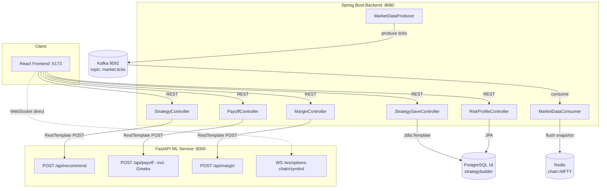
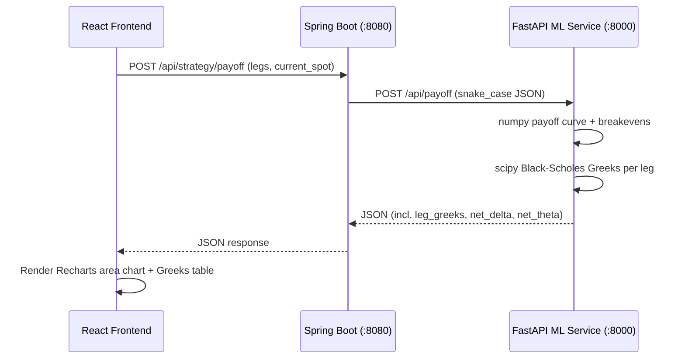
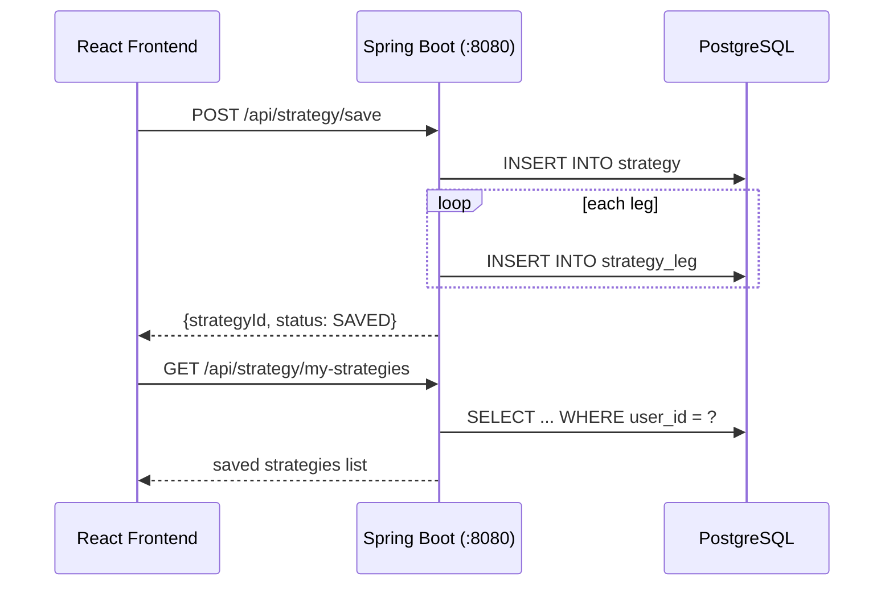
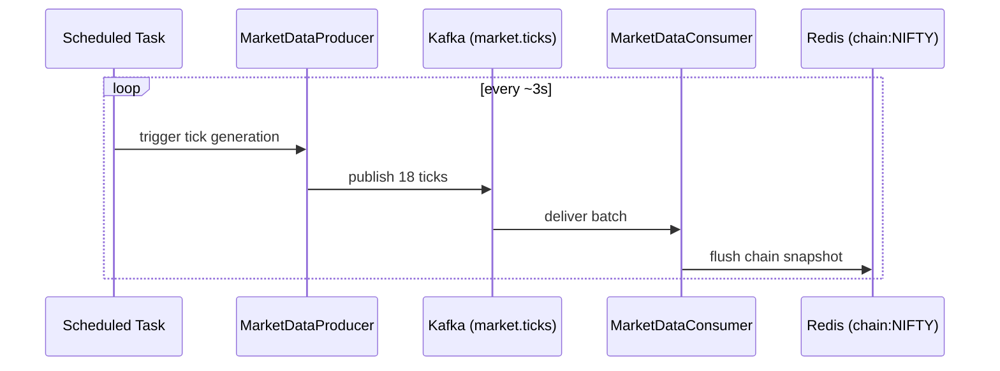

# Strategy Builder — Moneylogix

An options strategy builder platform that profiles a user's risk appetite, recommends option strategies, streams live options-chain data, calculates payoff diagrams with Black-Scholes Greeks, estimates margin requirements, and persists saved strategies to Postgres — with a full React frontend.

Repo: [Ananya-patel/Strategy_builder_moneylogix](https://github.com/Ananya-patel/Strategy_builder_moneylogix)

---

## Table of Contents

- [Architecture](#architecture)
- [Tech Stack](#tech-stack)
- [Project Structure](#project-structure)
- [Prerequisites](#prerequisites)
- [Setup & Run](#setup--run)
- [API Reference](#api-reference)
- [Frontend](#frontend)
- [Data Flow Diagrams](#data-flow-diagrams)
- [Build Progress](#build-progress)
- [Troubleshooting](#troubleshooting)
- [Git Workflow](#git-workflow)
- [Known Limitations / Honest Caveats](#known-limitations--honest-caveats)

---

## Architecture



**Three components working together:**

1. **Spring Boot backend (:8080)** — owns all persistence via Flyway-migrated PostgreSQL schema, exposes REST APIs, and proxies compute-heavy requests (payoff, margin, recommendation) to the Python ML service via `RestTemplate`.
2. **FastAPI ML service (:8000)** — stateless numeric engine (NumPy + SciPy) for payoff curves, Black-Scholes Greeks (delta, theta), margin estimation, strategy recommendation, and a simulated live options-chain WebSocket feed.
3. **Kafka → Redis pipeline** — `MarketDataProducer` simulates live option ticks every ~3 seconds, publishes to Kafka topic `market.ticks`, `MarketDataConsumer` fans out to Redis (hot cache under `chain:NIFTY`) for instant reads. This is a second, independent live-data mechanism from the FastAPI WebSocket — decoupled ingestion vs. delivery, useful to call out as an architecture/resilience story in the demo.
4. **React frontend** — risk assessment quiz, strategy recommendation card, live payoff chart with breakeven/Greeks, live option chain table (consuming the FastAPI WebSocket directly), and a saved strategies panel.

---

## Tech Stack

| Layer | Technology |
|---|---|
| Backend | Java 17+, Spring Boot 4.1.0, Spring Data JPA, Spring Data Redis, Spring Kafka, Spring Security (dev-mode) |
| ML / Compute service | Python, FastAPI, NumPy, SciPy, Pydantic, Uvicorn |
| Frontend | React 19, TypeScript, Vite, Tailwind CSS, Recharts |
| Database | PostgreSQL 16 |
| Schema migrations | Flyway (6 versioned migrations) |
| Cache | Redis — `chain:NIFTY` key |
| Event streaming | Apache Kafka |
| Build tools | Maven, npm |

---

## Project Structure
strategy-builder/
├── backend/
│   └── src/main/java/com/moneylogix/strategybuilder/
│       ├── StrategyBuilderBackendApplication.java
│       ├── riskprofile/
│       │   ├── RiskProfile.java              # JPA entity (@Entity, UUID PK)
│       │   ├── RiskBand.java                 # enum CONSERVATIVE/MODERATE/AGGRESSIVE
│       │   ├── RiskProfileController.java    # POST /api/risk-profile, GET /api/risk-profile/me
│       │   ├── RiskProfileRepository.java    # JPA repo
│       │   ├── RiskProfileRequestDto.java
│       │   ├── RiskProfileResponseDto.java
│       │   └── RiskProfileService.java       # weighted scoring engine
│       ├── strategy/
│       │   ├── OptionLegDto.java
│       │   ├── PayoffRequestDto.java
│       │   ├── PayoffResponseDto.java        # incl. legGreeks, netDelta, netTheta
│       │   ├── LegGreeksDto.java
│       │   ├── PayoffController.java         # POST /api/strategy/payoff
│       │   ├── MarginRequestDto.java
│       │   ├── MarginResponseDto.java
│       │   ├── MarginController.java         # POST /api/strategy/margin
│       │   ├── StrategyController.java       # GET /api/strategy/recommend
│       │   ├── StrategySaveRequest.java
│       │   └── StrategySaveController.java   # POST /api/strategy/save, GET /api/strategy/my-strategies
│       └── marketdata/
│           ├── MarketDataProducer.java        # @Scheduled every 3s → Kafka
│           └── MarketDataConsumer.java        # @KafkaListener → Redis
│   └── src/main/resources/
│       ├── application.yml
│       └── db/migration/                      # V1 .. V6
│
├── ml-service/
│   └── main.py                                 # recommend, payoff+greeks, margin, options-chain WS
│
└── frontend/
└── src/
├── App.tsx                             # main risk assessment page
├── api.ts                              # typed API client
├── PayoffChart.tsx                     # Recharts payoff diagram + Greeks
├── LiveOptionChain.tsx                 # WebSocket-driven live chain table
└── SavedStrategies.tsx                 # saved strategies list panel
---

## Prerequisites

- **Java 17+**
- **Maven**
- **Python 3.10+** with `pip`
- **Node.js 18+** with `npm`
- **PostgreSQL 16** — database `strategybuilder` created
- **Redis** — default port 6379
- **Kafka** — `localhost:9092`, topic `market.ticks` (auto-created if `allow.auto.create.topics=true`)
- **Docker Desktop** (optional) — if running Postgres/Redis/Kafka as containers

---

## Setup & Run

You'll run **three** processes in three separate terminals: FastAPI, Spring Boot, and the React dev server.

### 1. Start infrastructure (Postgres, Redis, Kafka)

If using Docker:
```powershell
cd C:\path\to\strategy-builder
docker compose up -d
docker compose ps
```

If disk space is low, clean up first:
```powershell
docker system prune -f
docker volume prune -f
```

### 2. Start the ML service (FastAPI)

```powershell
cd ml-service
pip install fastapi uvicorn numpy scipy pydantic websockets --break-system-packages
uvicorn main:app --reload --port 8000
```

Verify:
```powershell
curl http://localhost:8000/health
```
Expected: `{"status":"ok"}`

> Run with `--reload` during development — without it, `main.py` changes won't take effect until you manually restart uvicorn.

### 3. Start the Spring Boot backend

```powershell
cd backend
mvn spring-boot:run
```

Force a clean rebuild if edits aren't picked up:
```powershell
mvn clean spring-boot:run
```

Watch for:
Started StrategyBuilderBackendApplication
Published 18 ticks for NIFTY
Flushed chain snapshot to Redis: chain:NIFTY
This confirms Tomcat (8080), Postgres, Flyway migrations, Kafka producer/consumer, and Redis are all wired up.

Flyway runs all 6 migrations automatically on first startup; on subsequent startups it validates and skips.

### 4. Confirm `application.yml` has the ML service URL

```yaml
ml:
  service:
    url: http://localhost:8000
```
`PayoffController` and `MarginController` read this via `@Value("${ml.service.url:http://localhost:8000}")` — the fallback keeps the app from hard-crashing if the property is momentarily missing.

### 5. Re-seed the demo risk profile after a fresh database

If the Postgres volume was recreated, re-run:
```powershell
curl -X POST http://localhost:8080/api/risk-profile -H "Content-Type: application/json" -d "{\"answers\":{\"loss_tolerance\":2,\"drawdown_reaction\":2,\"investment_horizon\":3,\"income_stability\":3,\"prior_experience\":2,\"goal\":2}}"
```

### 6. Start the frontend

```powershell
cd frontend
npm install
npm run dev
```

Vite prints the local URL — usually `http://localhost:5173` (falls back to `5174` if taken). Both ports are allowlisted in every backend controller's `@CrossOrigin`.

---

## API Reference

### Risk Profile

**POST** `/api/risk-profile` — submit a 6-question quiz, get a scored risk band back.

```powershell
curl -X POST http://localhost:8080/api/risk-profile ^
  -H "Content-Type: application/json" ^
  -d "{\"answers\":{\"loss_tolerance\":2,\"drawdown_reaction\":2,\"investment_horizon\":3,\"income_stability\":3,\"prior_experience\":2,\"goal\":2}}"
```

Response:
```json
{"id":"...","userId":"11111111-1111-1111-1111-111111111111","riskBand":"MODERATE","score":28,"createdAt":"..."}
```

**Weighted scoring logic** (in `RiskProfileService.calculateScore`):

| Question | Weight | Rationale |
|---|---|---|
| loss_tolerance | 3 | Strongest predictor of real trading behaviour under stress |
| drawdown_reaction | 3 | Reveals panic-selling tendency |
| investment_horizon | 2 | Affects which strategies are viable |
| income_stability | 2 | Determines capital availability |
| prior_experience | 1 | Informational only |
| goal | 1 | Informational only |

Max score = 48. Bands: `CONSERVATIVE` (0–20), `MODERATE` (21–36), `AGGRESSIVE` (37–48).

**GET** `/api/risk-profile/me` — returns the most recent saved profile for the demo user.

---

### Strategy Recommendation

**GET** `/api/strategy/recommend` — looks up the saved risk profile, calls the ML service, returns the recommended strategy.

```powershell
curl http://localhost:8080/api/strategy/recommend
```

Mapping (`STRATEGY_MAP` in `main.py`):

| Risk Band | Strategy |
|---|---|
| CONSERVATIVE | Covered Call |
| MODERATE | Iron Condor |
| AGGRESSIVE | Long Straddle |

---

### Payoff Diagram + Greeks

**POST** `/api/strategy/payoff` — given option legs and current spot, returns the full payoff curve, breakeven points, max profit/loss, and per-leg Black-Scholes Greeks (delta, theta) plus net totals.

```powershell
curl -X POST http://localhost:8080/api/strategy/payoff ^
  -H "Content-Type: application/json" ^
  -d "{\"legs\":[{\"option_type\":\"put\",\"position\":\"sell\",\"strike\":24600,\"premium\":30},{\"option_type\":\"put\",\"position\":\"buy\",\"strike\":24500,\"premium\":15},{\"option_type\":\"call\",\"position\":\"sell\",\"strike\":25000,\"premium\":30},{\"option_type\":\"call\",\"position\":\"buy\",\"strike\":25100,\"premium\":15}],\"current_spot\":24800}"
```

Response (iron condor example, verified):
```json
{
  "breakevens": [24570.0, 25030.0],
  "max_profit": 30.0,
  "max_loss": -70.0,
  "net_delta": -0.0031,
  "net_theta": 2.4377,
  "leg_greeks": [
    {"strike": 24600.0, "option_type": "put", "position": "sell", "delta": 0.3243, "theta": 11.8926},
    {"strike": 24500.0, "option_type": "put", "position": "buy", "delta": -0.2573, "theta": -10.8094},
    {"strike": 25000.0, "option_type": "call", "position": "sell", "delta": -0.3741, "theta": 15.447},
    {"strike": 25100.0, "option_type": "call", "position": "buy", "delta": 0.304, "theta": -14.0925}
  ],
  "spot_prices": [...],
  "payoff": [...]
}
```

| Field | Type | Default | Notes |
|---|---|---|---|
| `legs` | array of leg objects | — | see leg shape below |
| `current_spot` | number | — | required |
| `spot_range_pct` | number | 0.1 | ± range around spot to plot |
| `steps` | int | 100 | resolution of the payoff curve |

Leg shape:
```json
{"option_type": "call|put", "position": "buy|sell", "strike": 24900, "premium": 45, "quantity": 1, "iv": 0.15, "days_to_expiry": 7}
```
`iv` and `days_to_expiry` are optional (default 15% IV, 7 days) and feed the Greeks calculation.

**Greeks methodology**: standard Black-Scholes closed-form delta and theta per leg, sign-adjusted for buy (+1) vs sell (-1) and scaled by quantity, summed into `net_delta`/`net_theta`. A delta-neutral strategy (e.g. a centered iron condor) should net close to 0 — a useful sanity check, confirmed above.

---

### Margin Estimator

**POST** `/api/strategy/margin`

Response:
```json
{"is_defined_risk":true,"margin_required":70.0,"max_loss":-70.0,"method":"max_loss"}
```

**Methodology** (approximation — not a real exchange SPAN calculation, which requires risk-parameter files not available outside a broker):
- **Defined-risk strategies** (spreads, iron condors): `margin_required = abs(max_loss)`.
- **Undefined-risk strategies** (naked short call/put): per short leg, `margin = (15% of notional) + (3% of notional) − premium collected`, floored at 5% of notional — the standard retail-broker heuristic.

Risk type is auto-detected by checking whether the payoff curve keeps worsening at the far edges of a wide spot-price range (±50%).

---

### Save / Load Strategy

**POST** `/api/strategy/save` — persists a constructed strategy (name, symbol, legs) to Postgres.

```powershell
curl -X POST http://localhost:8080/api/strategy/save ^
  -H "Content-Type: application/json" ^
  -d "{\"name\":\"My Iron Condor\",\"underlyingSymbol\":\"NIFTY\",\"legs\":[{\"optionType\":\"put\",\"action\":\"sell\",\"strikePrice\":24600,\"expiryDate\":\"2026-08-06\",\"quantity\":1,\"premium\":30}]}"
```

Response:
```json
{"strategyId":"...","status":"SAVED"}
```

**GET** `/api/strategy/my-strategies` — lists saved strategies for the demo user, most recent first.

Backed by `strategy` / `strategy_leg` tables (`V3__create_strategies.sql`), written via `JdbcTemplate` (not JPA). `option_type`/`action` are stored uppercase (`CALL`/`PUT`, `BUY`/`SELL`) per DB `CHECK` constraints — the controller uppercases whatever case the frontend sends.

---

### Live Options Chain (WebSocket)

**WS** `ws://localhost:8000/ws/options-chain/{symbol}` — streams a simulated options chain every 1.5s, consumed directly by the frontend's `LiveOptionChain.tsx` (bypassing Spring Boot for this feed).

```json
{
  "symbol": "NIFTY",
  "spot": 24812.35,
  "timestamp": "...",
  "chain": [
    {"strike": 24800, "call": {"ltp":..., "iv":..., "oi":..., "volume":...}, "put": {...}}
  ]
}
```

Separately, the backend's own **Kafka → Redis pipeline** simulates ticks independently — `MarketDataProducer` publishes ~18 ticks per cycle, `MarketDataConsumer` flushes a snapshot into Redis under `chain:NIFTY`. Two independent live-data mechanisms — worth calling out as a decoupled ingestion/delivery architecture story in the demo.

---

## Frontend

Single-page React app (`App.tsx`), dark MoneyLogix-branded UI:

1. **Risk Assessment quiz** — 6 sliders → `/api/risk-profile` → `/api/strategy/recommend`.
2. **Recommendation card** — glowing border colored by risk band, animated confidence bar, max profit/loss.
3. **Payoff Diagram** (`PayoffChart.tsx`) — Recharts gradient-filled area chart with breakeven/spot reference lines, max profit/loss/net delta/net theta stat cards, per-leg Greeks breakdown.
4. **Save Strategy button** — persists the current recommendation's legs to Postgres.
5. **Live Option Chain** (`LiveOptionChain.tsx`) — direct WebSocket connection, strike-laddered table, ATM row highlight, pulsing live indicator.
6. **Saved Strategies panel** (`SavedStrategies.tsx`) — lists everything saved so far.

Strategy → leg templates are hardcoded client-side in `STRATEGY_LEGS` (`App.tsx`) for the three recommended strategies — feeding both the payoff calculation and the save payload.

---

## Data Flow Diagrams

### Payoff / Greeks request flow



### Save Strategy flow



### Kafka → Redis market data pipeline



---

## Build Progress

| Step | Feature | Status |
|---|---|---|
| 4 | Risk Profile API (weighted scoring, save/get) | ✅ Done |
| 5 | ML service recommendation stub | ✅ Done |
| 6 | Live options chain (WebSocket + Kafka/Redis pipeline) | ✅ Done |
| 7 | Payoff diagram (breakeven, max P&L) | ✅ Done |
| 8 | Margin estimator (defined/undefined risk detection) | ✅ Done |
| 9 | Black-Scholes Greeks (delta, theta) — per-leg + net | ✅ Done |
| 10 | Strategy save/load (Postgres) | ✅ Done |
| — | Frontend: risk quiz UI | ✅ Done |
| — | Frontend: payoff chart + Greeks display | ✅ Done |
| — | Frontend: live option chain table | ✅ Done |
| — | Frontend: save strategy + saved strategies panel | ✅ Done |
| — | Paper trading hook | ⏳ Skipped for this milestone |

---

## Troubleshooting

**`Port 8080 was already in use`**
```powershell
netstat -ano | findstr :8080
taskkill /PID <pid_from_above> /F
```

**`Could not resolve placeholder 'ml.service.url'`**
Give the `@Value` injection a fallback:
```java
@Value("${ml.service.url:http://localhost:8000}")
```

**`422 Unprocessable Content` from FastAPI, even though the Java DTO "looks right"**
Class-level `@JsonNaming(SnakeCaseStrategy.class)` can silently fail to apply. Use explicit per-field `@JsonProperty("snake_case_name")` instead — the actual fix used throughout for `OptionLegDto`, `MarginRequestDto`, `PayoffRequestDto`, `MarginResponseDto`, `PayoffResponseDto`, `LegGreeksDto`.

**Frontend requests failing silently / CORS errors in browser console**
Every controller needs its own `@CrossOrigin(origins = {"http://localhost:5173", "http://localhost:5174"})` — Spring doesn't share CORS config across controllers automatically. `PayoffController` and `MarginController` were both missing this entirely at first.

**Vite picks port 5174 instead of 5173, or vice versa**
Auto-increments if the default is taken. Both ports are allowlisted everywhere for exactly this reason.

**`Out-File` (PowerShell) corrupts Java files with a BOM → `illegal character: '\ufeff'`**
Strip it after writing:
```powershell
$content = Get-Content <file> -Raw
[System.IO.File]::WriteAllText((Resolve-Path <file>), $content, (New-Object System.Text.UTF8Encoding $false))
```

**Maven says "Nothing to compile" but your edit isn't reflected at runtime**
```powershell
mvn clean spring-boot:run
```

**`No plugin found for prefix 'spring-boot'` or `ModuleNotFoundError`**
Run `mvn spring-boot:run` from `backend/`, and `uvicorn main:app` from `ml-service/` — not the project root.

**FastAPI websocket crashes with `NameError: name 'datetime' is not defined`**
```python
from datetime import date, datetime
```

**Windows Command Prompt: `'#' is not recognized`**
`#` is a bash comment character, not recognized by `cmd.exe` — harmless, use `::` or `rem` instead.

---

## Git Workflow

```powershell
cd C:\Users\Nainsukh\strategy-builder
git remote -v
git remote add origin https://github.com/Ananya-patel/Strategy_builder_moneylogix.git
# or, if origin already points elsewhere:
git remote set-url origin https://github.com/Ananya-patel/Strategy_builder_moneylogix.git

git branch
git push -u origin main
```

Regular commits:
```powershell
git add .
git commit -m "Step N: <what changed> - <why>"
git push
```

> Requires collaborator (write) access for `git push` to succeed over HTTPS — otherwise fork and open a PR. GitHub requires a Personal Access Token (not your account password) for HTTPS pushes.

---

## Known Limitations / Honest Caveats

- Margin estimation is a **heuristic approximation**, not a real exchange SPAN calculation — accurate for demo/pitch purposes, not for live trading decisions.
- Greeks use **default assumed IV (15%) and days-to-expiry (7)** per leg unless explicitly overridden — not sourced from the live chain's actual per-strike IV. A natural stretch: feed live-chain IV into the Greeks calculation.
- Spring Security is disabled/dev-mode — must be properly configured before production.
- Options chain data (both the WebSocket and Kafka/Redis pipeline) is **simulated/random**, not real market data.
- Strategy → leg mapping in the frontend is hardcoded for the three recommended strategies rather than a free-form multi-leg builder — a real builder UI is the natural next step.
- "Positions," "Watchlist," "Orders" sidebar items are placeholders with no backing functionality — only "Risk Profile" is implemented.
- Saved strategies use a single hardcoded demo user (`11111111-1111-1111-1111-111111111111`) — no real authentication/multi-user support yet.
